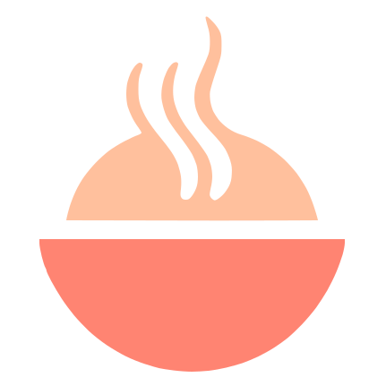
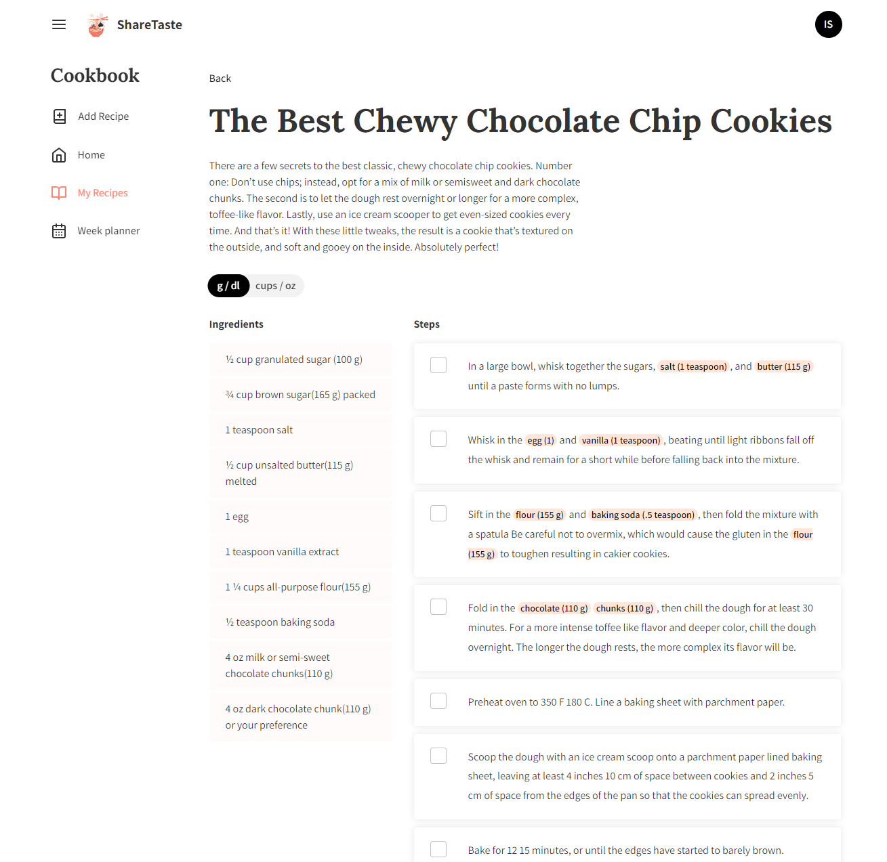
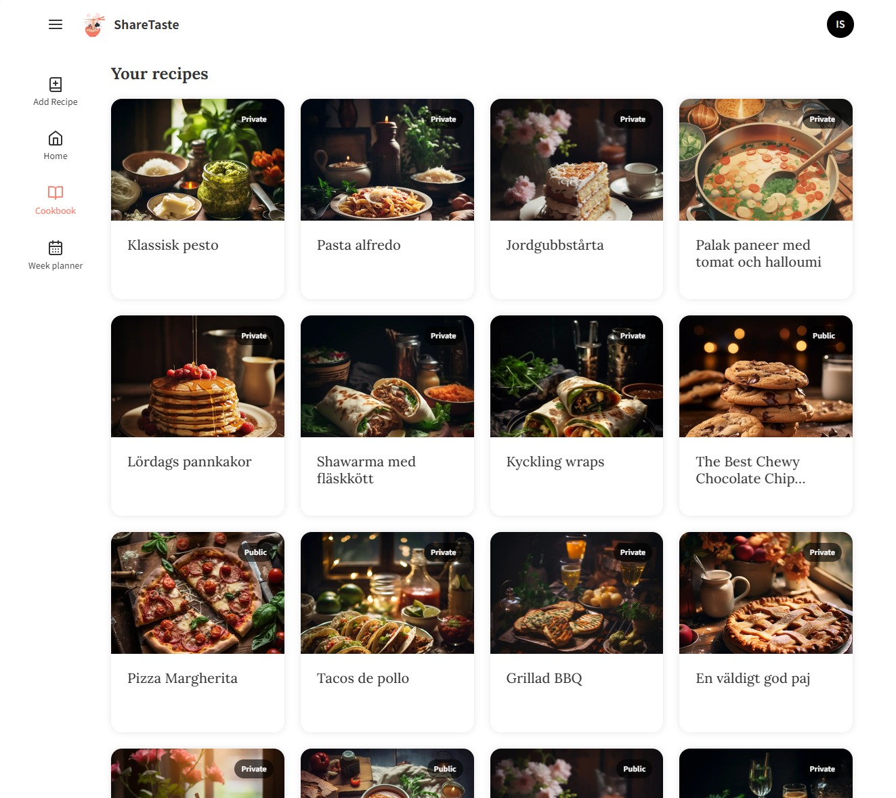
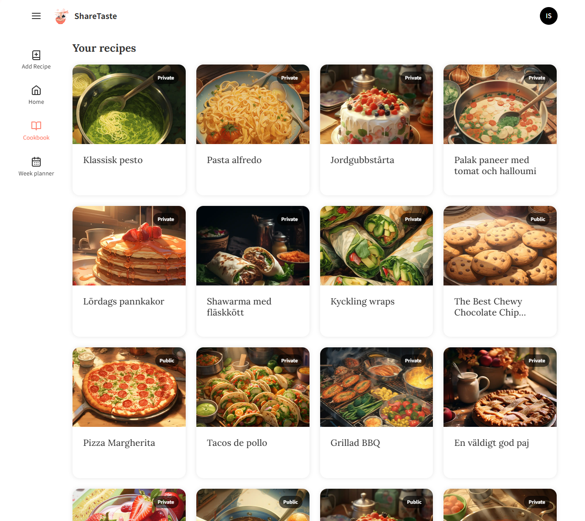
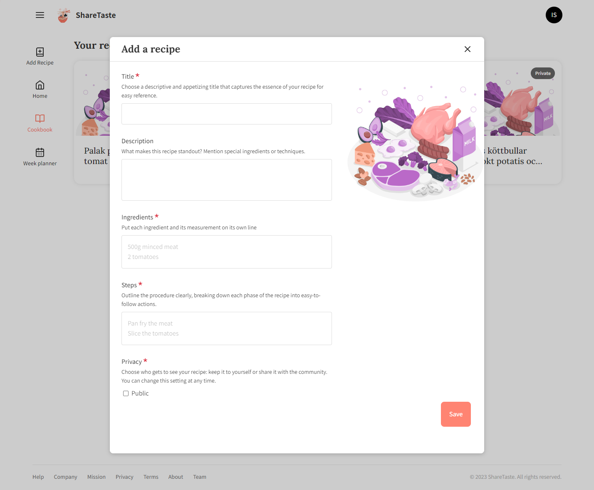
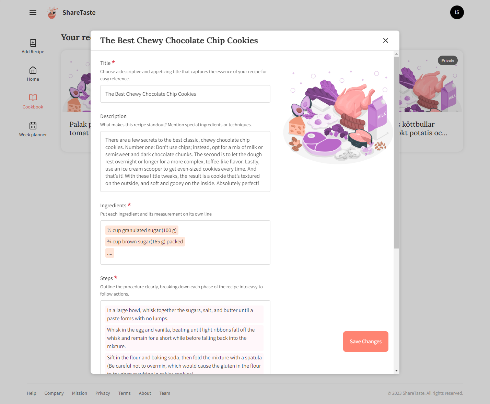
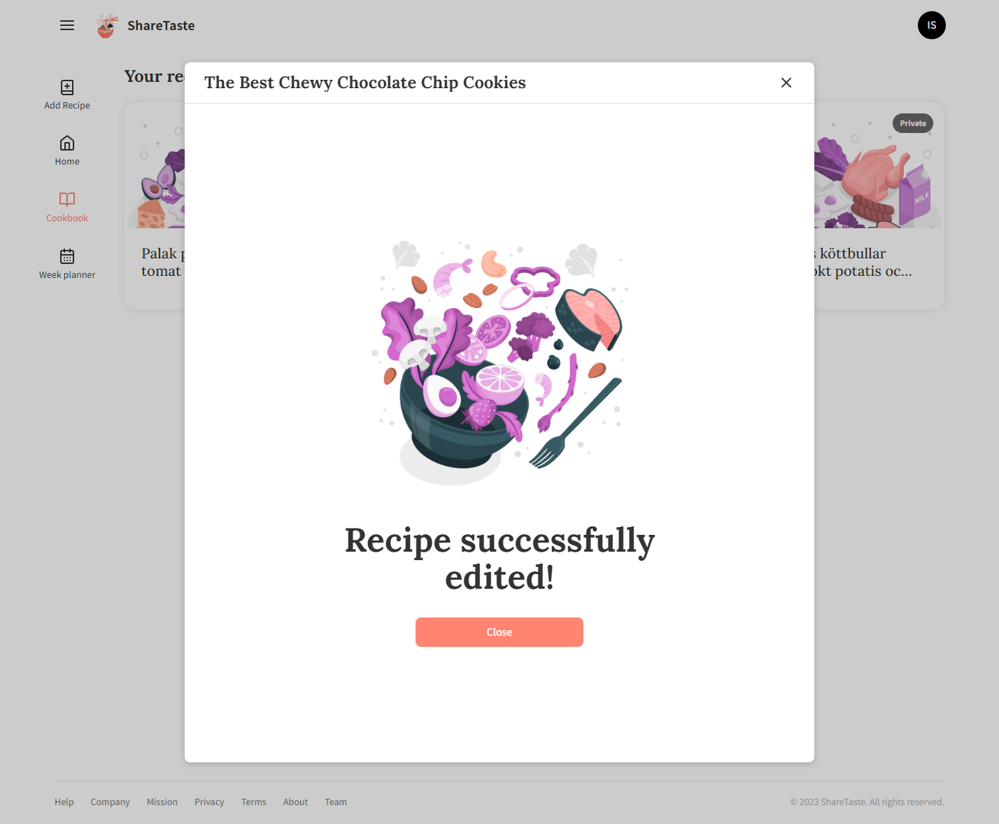
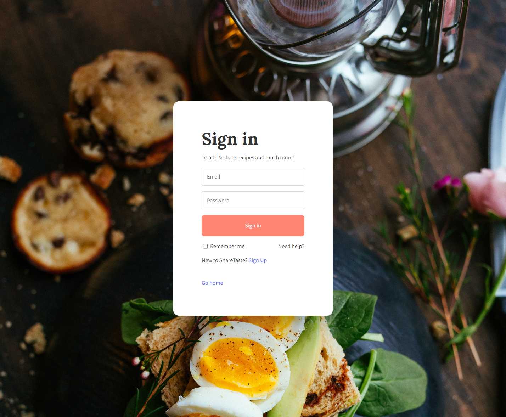
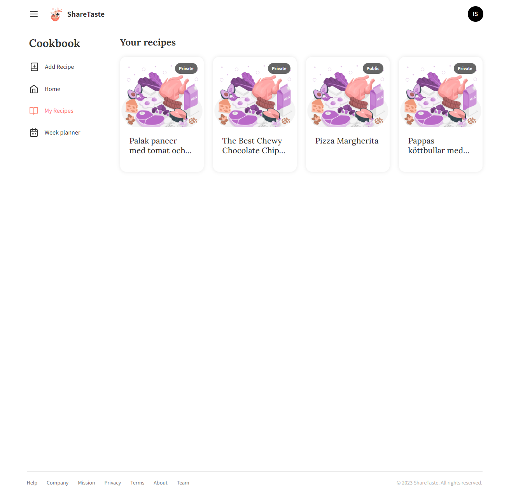
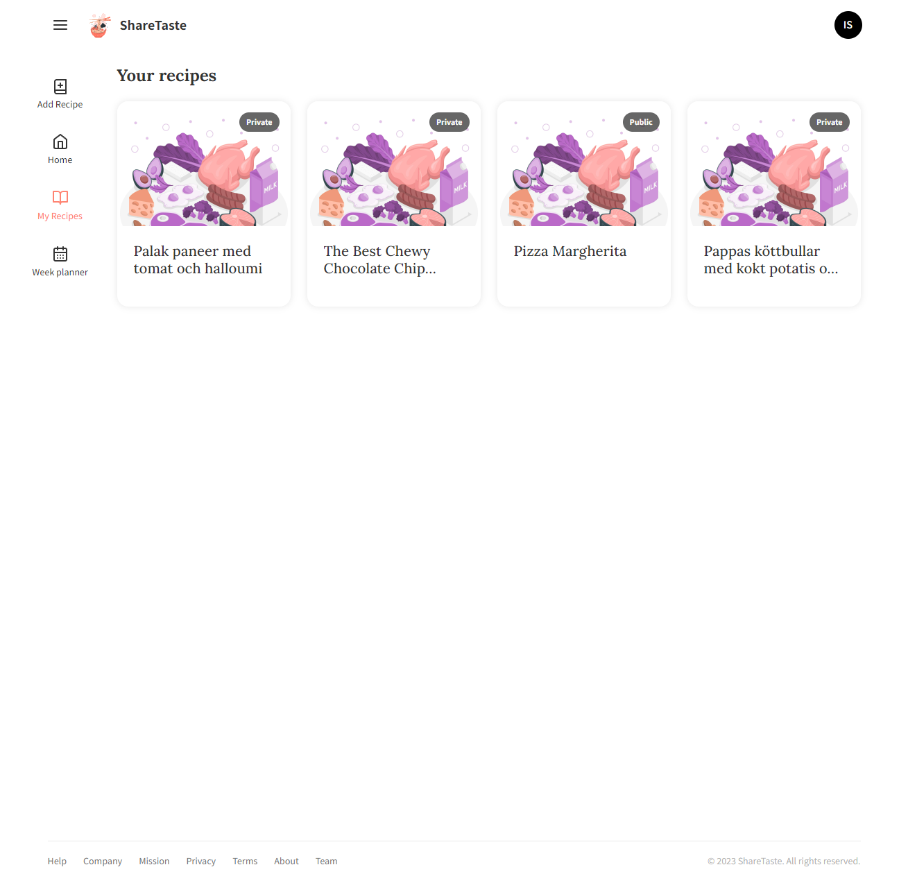

<!-- Improved compatibility of back to top link: See: https://github.com/othneildrew/Best-README-Template/pull/73 -->

<!--
*** Thanks for checking out the Best-README-Template. If you have a suggestion
*** that would make this better, please fork the repo and create a pull request
*** or simply open an issue with the tag "enhancement".
-->

<!-- PROJECT SHIELDS -->
<!--
*** I'm using markdown "reference style" links for readability.
*** Reference links are enclosed in brackets [ ] instead of parentheses ( ).
*** See the bottom of this document for the declaration of the reference variables
*** for contributors-url, forks-url, etc. This is an optional, concise syntax you may use.
*** https://www.markdownguide.org/basic-syntax/#reference-style-links
-->

[![Contributors][contributors-shield]][contributors-url]
[![Forks][forks-shield]][forks-url]
[![Stargazers][stars-shield]][stars-url]
[![Issues][issues-shield]][issues-url]
[![MIT License][license-shield]][license-url]
[![LinkedIn][linkedin-shield]][linkedin-url]

<!-- PROJECT LOGO -->
 

  

  

    Your Friendly Kitchen Companion: Dive Into a World of Recipes with Auto-Quantities, Adaptive Imagery, and a Treasure Trove of Fresh Features!
     
    <a target="_blank" href="https://sharetaste.io/"><strong>Explore now »</strong></a>
     
     
    <a href="https://github.com/johnschatner/sharetaste/issues">Report Bug</a>
    ·
    <a href="https://github.com/johnschatner/sharetaste/issues">Request Feature</a>
  

<!-- TABLE OF CONTENTS -->

  
Table of Contents

  <ol>
    <li>
      <a href="#about-the-project">About The Project</a>
      <ul>
        <li><a href="#built-with">Built With</a></li>
      </ul>
    </li>
    <li><a href="#faq">FAQ</a></li>
    <li><a href="#roadmap">Roadmap</a></li>
    <li><a href="#screenshots">Screenshots</a></li>
    <li><a href="#contact">Contact</a></li>
    <li><a href="#license">License</a></li>
  </ol>

<!-- ABOUT THE PROJECT -->

## About The Project

[![Product Name Screen Shot][product-screenshot]]()

Embark on a culinary journey like no other with our intuitive recipe platform. Unleash the gourmet in you with smart features like automatic image pairing and quantity adjustments, coupled with a seamless recipe sharing experience. Whether it's crafting weekly meal plans or discovering new recipes, we've got you covered. Get ready to redefine your cooking adventures with a sprinkle of technology and a dash of convenience, all wrapped up in one vibrant community. Your delightful kitchen companion awaits!
 

- **Personalized Recipe Sharing**: Share your recipes with friends and family with the flexibility to set them as public or private.
- **Intelligent Image Analysis**: Automatically pairs your recipe with the best matching image, choosing from a range of illustrated or realistic visuals.
- **Auto-Adjusting Quantities**: Effortlessly integrate automatic quantity adjustments directly within the recipe steps, making scaling recipes a breeze.
- **Smart Weekly Meal Plans**: Generate weekly meal plans automatically, tailored to your personal recipe collection or sourced from popular public recipes, all aligned with your preferences.
- **Discover Culinary Treasures**: Explore and discover new recipes to expand your culinary horizons and inspire your next meal.

(<a href="#readme-top">back to top</a>)

### Built With

- [React](https://reactjs.org/)
- [Firebase](https://firebase.google.com/)
- [Vite](https://vitejs.dev/)

(<a href="#readme-top">back to top</a>)

<!-- FAQ -->

## FAQ

### Q1: What is the main purpose of this project?

A1: (Your Answer Here)

### Q2: How can I get access to the full project?

A2: (Your Answer Here)

### Q3: Are there any upcoming features or updates?

A3: (Your Answer Here)

### Q4: Can I contribute to the project?

A4: (Your Answer Here)

### Q5: Who should I contact for support or inquiries?

A5: (Your Answer Here)

(<a href="#readme-top">back to top</a>)

<!-- ROADMAP -->

## Roadmap

- [ ] Flesh out the recipe creation
- [ ] Develop recipe steps and other features

See the [open issues](https://github.com/johnschatner/sharetaste/issues) for a full list of proposed features (and known issues).

(<a href="#readme-top">back to top</a>)

<!-- SCREENSHOTS -->

## Screenshots

<!-- CONTACT -->

## Contact

Isac - isacrs.dev@gmail.com

Project Link: [https://github.com/johnschatner/sharetaste](https://github.com/johnschatner/sharetaste)

(<a href="#readme-top">back to top</a>)

<!-- LICENSE -->

## License

This project is proprietary and protected under a commercial license. Usage, reproduction, and distribution of this project are strictly prohibited without the acquisition of the appropriate license from the owner. For more information on obtaining a license, please contact the project owner at isacrs.dev@gmail.com.

All rights of the owner are reserved. Unauthorized use of this project in any form is a violation of applicable copyright, trademark, and/or other intellectual property laws.

© 2023 ShareTaste, All Rights Reserved.

(<a href="#readme-top">back to top</a>)

<!-- MARKDOWN LINKS & IMAGES -->
<!-- https://www.markdownguide.org/basic-syntax/#reference-style-links -->

[contributors-shield]: https://img.shields.io/github/contributors/johnschatner/sharetaste.svg?style=for-the-badge
[contributors-url]: https://github.com/johnschatner/sharetaste/graphs/contributors
[forks-shield]: https://img.shields.io/github/forks/johnschatner/sharetaste.svg?style=for-the-badge
[forks-url]: https://github.com/johnschatner/sharetaste/network/members
[stars-shield]: https://img.shields.io/github/stars/johnschatner/sharetaste.svg?style=for-the-badge
[stars-url]: https://github.com/johnschatner/sharetaste/stargazers
[issues-shield]: https://img.shields.io/github/issues/johnschatner/sharetaste.svg?style=for-the-badge
[issues-url]: https://github.com/johnschatner/sharetaste/issues
[license-shield]: https://img.shields.io/github/license/johnschatner/sharetaste.svg?style=for-the-badge
[license-url]: https://github.com/johnschatner/sharetaste/blob/master/LICENSE.txt
[linkedin-shield]: https://img.shields.io/badge/-LinkedIn-black.svg?style=for-the-badge&logo=linkedin&colorB=555
[linkedin-url]: https://linkedin.com/in/isac-rasmusson-99344924b
[product-screenshot]: public/project-showcase.webp
[next.js]: https://img.shields.io/badge/next.js-000000?style=for-the-badge&logo=nextdotjs&logoColor=white
[next-url]: https://nextjs.org/
[react.js]: https://img.shields.io/badge/React-20232A?style=for-the-badge&logo=react&logoColor=61DAFB
[react-url]: https://reactjs.org/
[vue.js]: https://img.shields.io/badge/Vue.js-35495E?style=for-the-badge&logo=vuedotjs&logoColor=4FC08D
[vue-url]: https://vuejs.org/
[angular.io]: https://img.shields.io/badge/Angular-DD0031?style=for-the-badge&logo=angular&logoColor=white
[angular-url]: https://angular.io/
[svelte.dev]: https://img.shields.io/badge/Svelte-4A4A55?style=for-the-badge&logo=svelte&logoColor=FF3E00
[svelte-url]: https://svelte.dev/
[laravel.com]: https://img.shields.io/badge/Laravel-FF2D20?style=for-the-badge&logo=laravel&logoColor=white
[laravel-url]: https://laravel.com
[bootstrap.com]: https://img.shields.io/badge/Bootstrap-563D7C?style=for-the-badge&logo=bootstrap&logoColor=white
[bootstrap-url]: https://getbootstrap.com
[jquery.com]: https://img.shields.io/badge/jQuery-0769AD?style=for-the-badge&logo=jquery&logoColor=white
[jquery-url]: https://jquery.com
